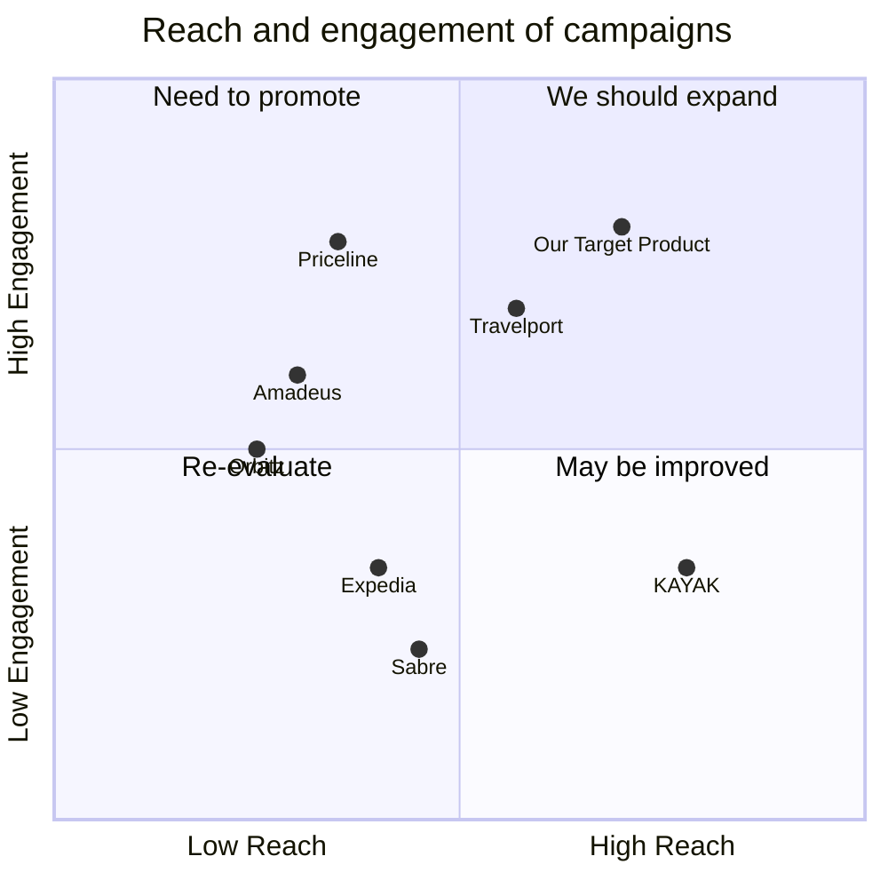

## Original Requirements
The boss has tasked us with building a virtual agent for an airline based on rasa 3.3.0.

## Product Goals
```python
[
    "Create a virtual agent that can handle customer inquiries and bookings efficiently",
    "Ensure the virtual agent is built on rasa 3.3.0",
    "Ensure the virtual agent can integrate seamlessly with the airline's existing systems"
]
```

## User Stories
```python
[
    "As a customer, I want to be able to make flight bookings through the virtual agent",
    "As a customer, I want to be able to check flight status through the virtual agent",
    "As a customer, I want to be able to make changes to my booking through the virtual agent",
    "As a customer, I want to be able to ask the virtual agent questions about the airline's policies",
    "As an airline representative, I want the virtual agent to be able to handle a high volume of customer interactions efficiently"
]
```

## Competitive Analysis
```python
[
    "Amadeus Virtual Travel Agent: Offers a wide range of services but lacks the ability to handle complex customer inquiries",
    "Sabre Virtual Travel Agent: Has advanced booking capabilities but lacks robust integration with airline systems",
    "Travelport Virtual Travel Agent: Offers seamless integration with airline systems but lacks advanced customer service capabilities",
    "KAYAK Virtual Travel Agent: Offers advanced customer service capabilities but lacks robust booking capabilities",
    "Expedia Virtual Travel Agent: Offers robust booking capabilities but lacks seamless integration with airline systems",
    "Priceline Virtual Travel Agent: Offers seamless integration with airline systems but lacks the ability to handle complex customer inquiries",
    "Orbitz Virtual Travel Agent: Offers a wide range of services but lacks advanced booking capabilities"
]
```

## Competitive Quadrant Chart


## Requirement Analysis
The product should be a virtual agent capable of handling customer inquiries, making bookings, checking flight status, and answering questions about the airline's policies. It should be built on rasa 3.3.0 and integrate seamlessly with the airline's existing systems.

## Requirement Pool
```python
[
    ("Virtual agent should be able to make flight bookings", "P0"),
    ("Virtual agent should be able to check flight status", "P0"),
    ("Virtual agent should be able to handle customer inquiries", "P0"),
    ("Virtual agent should be able to answer questions about airline policies", "P0"),
    ("Virtual agent should integrate seamlessly with airline's existing systems", "P0")
]
```

## UI Design draft
The UI of the virtual agent should be clean and user-friendly. It should have a chat window where the customer can type their queries and get responses from the virtual agent. The chat window should be large enough for the customer to view the conversation history. The virtual agent should also have a voice option for customers who prefer speaking to typing. The overall design should align with the airline's branding and color scheme.

## Anything UNCLEAR
There are no unclear points.