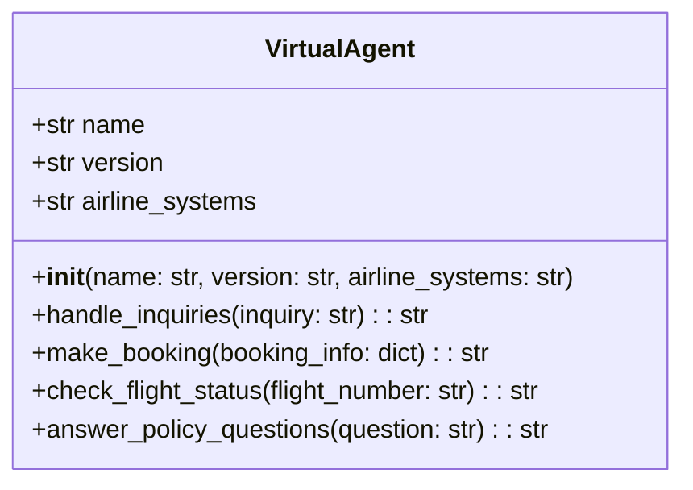
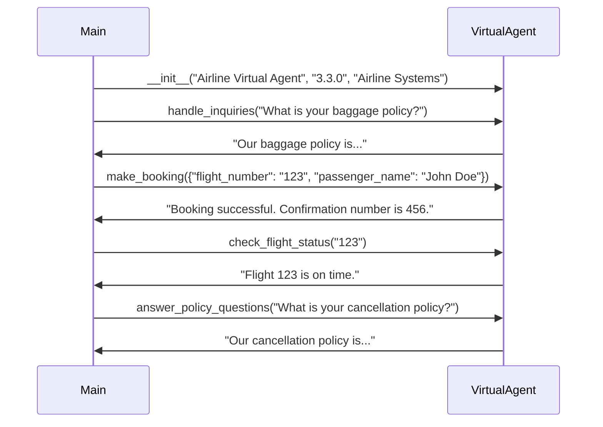

## Implementation approach
We will utilize the Rasa open-source framework to build the virtual agent. Rasa provides a robust platform for building AI chatbots and virtual agents, and it supports the version (3.3.0) specified in the requirements. The difficult points of the requirements include integrating the virtual agent with the airline's existing systems and ensuring the agent can handle complex customer inquiries. For integration, we will use Rasa's API to connect the virtual agent to the airline's booking and flight status systems. For handling complex inquiries, we will use Rasa's advanced natural language understanding capabilities to train the virtual agent.

## Python package name
```python
"airline_virtual_agent"
```

## File list
```python
[
    "main.py",
    "actions.py",
    "config.yml",
    "credentials.yml",
    "endpoints.yml",
    "domain.yml",
    "data/nlu.md",
    "data/stories.md"
]
```

## Data structures and interface definitions


## Program call flow


## Anything UNCLEAR
The requirement is clear to me.